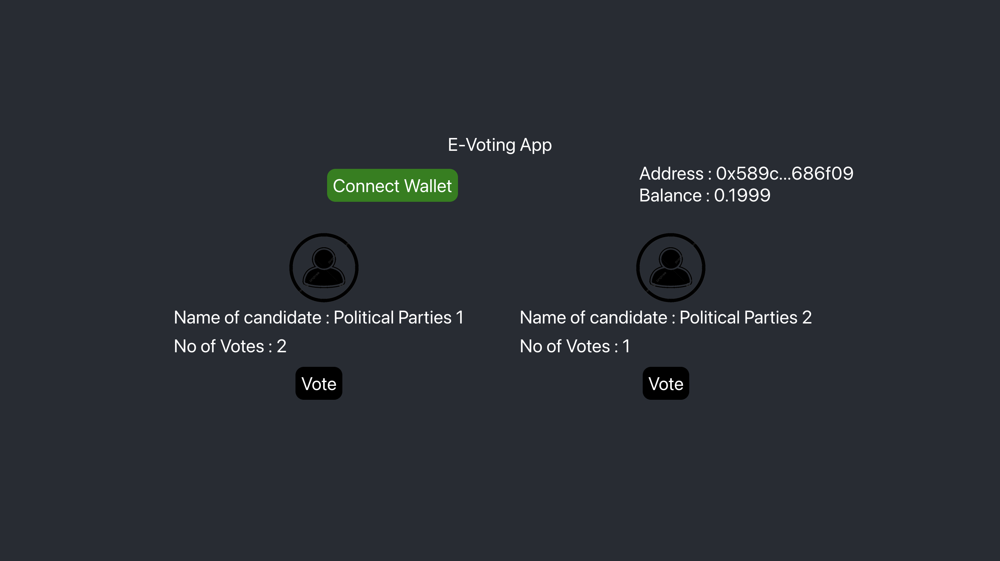

# Vote: Secure E-Voting with Blockchain Technology

Welcome to **BVote**, a cutting-edge e-voting platform powered by blockchain technology. With Vote, you can revolutionize the way elections are conducted, ensuring transparency, security, and accessibility like never before.

## Features

🔒 **Unparalleled Security**: Leverage the power of blockchain to establish an immutable and tamper-proof record of every vote. Say goodbye to concerns about election fraud and unauthorized access.

🌐 **Global Accessibility**: Vote from anywhere in the world, eliminating the need for physical presence. Empower voters to participate without geographical limitations.

⏱️ **Real-time Results**: Instantly track the progress of the election and access real-time results. Witness democracy in action as the votes are recorded and counted in real-time.

🤖 **Smart Contracts**: Utilize smart contracts to automate the entire voting process, ensuring that the rules are followed and results are accurate. No more manual counting or errors.

🔍 **Transparency and Auditability**: Every vote cast is recorded on the blockchain, ensuring that the process remains transparent and auditable. Rest assured that the integrity of the election is maintained.

## Getting Started

To get started with Vote, follow these simple steps:

1. **Clone the Repository**: Begin by cloning this repository to your local machine using the following command:

`git clone https://github.com/waseem0605/BVote`

2. **Install Dependencies**: Navigate to the project directory and install the necessary dependencies:

`cd BVote`

`npm install`

3. **Configure Blockchain**: Configure the blockchain network settings to ensure proper communication and consensus among nodes.

4. **Run the Application**: Launch the Vote application using:

`npm start`

This will start the development server and open the application in your default web browser.

5. **Access the Platform**: Open your web browser and visit `http://localhost:3000` to access the Vote platform.

## Available NPM Commands

- `npm install`: Installs project dependencies.
- `npm start`: Starts the development server and launches the Vote application.
- `npm test`: Runs tests to ensure the functionality of the application.
- `npm run build`: Builds the production-ready version of the application.

## Contributing

We welcome contributions from the community to make Vote even better. To contribute, follow these steps:

1. Fork the repository.
2. Create a new branch for your feature or bug fix.
3. Make your changes and test thoroughly.
4. Submit a pull request describing your changes.

## License

This project is licensed under the [MIT License](LICENSE).

---

Join us in shaping the future of secure and transparent elections with blockchain technology. Embrace the power of Vote and let's redefine democracy together!
